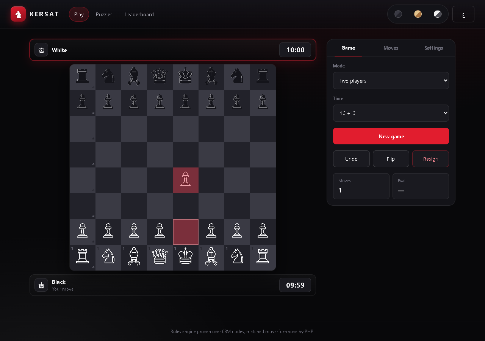
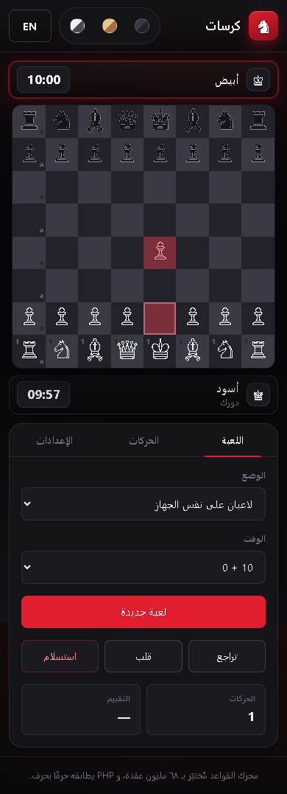
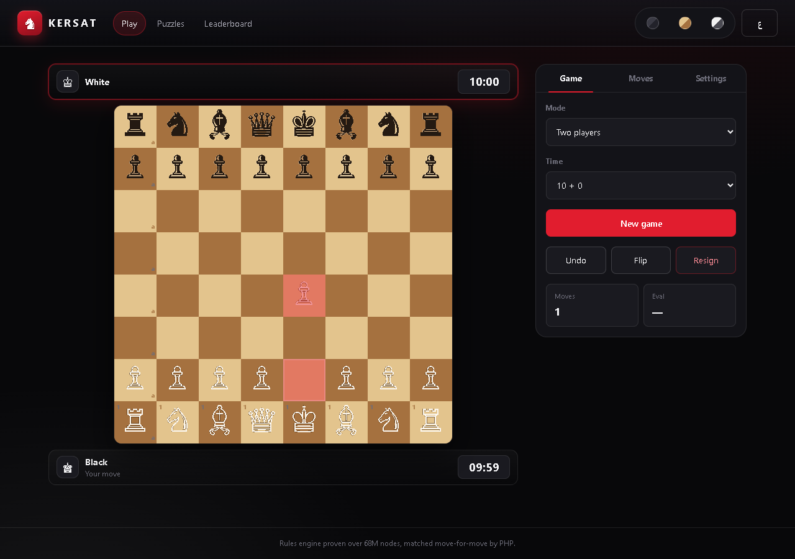

# ♞ Chess — bilingual chess for the web

Play chess in **Arabic or English**, with a real right-to-left interface, against an engine or against other people.

Vanilla JS single-page app + PHP 8.5 + MySQL. **No framework, no build step, no bundler.** Open `index.html` and it runs.



---

## What works right now

| | |
|---|---|
| **Playable board** | Click, drag, or use the keyboard. Legal-move dots, last-move highlight, check and mate marked. |
| **Promotion picker** | Queen / rook / bishop / knight, correctly gated. |
| **Clocks** | Countdown with increment, resign on flag, `3+2 / 5+0 / 10+0 / 15+10 / 30+0 / untimed`. |
| **Game tools** | Move list in algebraic notation, undo, flip, FEN setup, copy PGN, copy FEN. |
| **Three board themes** | Dark cinema, wood, high-contrast. |
| **Full Arabic** | Real RTL, Arabic piece names, Arabic result text, mirrored layout that is *not* just a mirrored board. |
| **Sound** | WebAudio move / capture / check tones. No audio files. |
| **Rules engine** | 0x88, full legality: castling, en passant, promotion, threefold, fifty-move, insufficient material. |
| **Server engine** | `api/includes/Engine.php` mirrors the JS engine for server-authoritative validation. |

**Not built yet:** accounts, online multiplayer, the database schema, ratings, chat, and the production Stockfish build. See [STATUS.md](STATUS.md).

<p align="center">
  
  
</p>

---

## Quick start

You need **Node 18+** for the tests and tooling. The app itself needs neither.

```bash
# serve it (any static server works)
npm run serve:php          # -> http://127.0.0.1:8080
```

`serve:php` uses PHP's built-in server. PHP is resolved automatically: the `PHP_BIN`
environment variable, then `tools/php/php.exe`, then the usual install paths. To force one:

```bash
PHP_BIN=/path/to/php.exe npm run serve:php
```

The page is also fine over `file://` — there is no build step and no fetch of local assets.

## Tests

Four suites, all of them real:

```bash
npm test              # 102 engine tests (node:test)
npm run test:php      # 380 assertions across 3 PHP suites
npm run test:ui       # 62 Playwright checks against a live browser
npm run test:visual   # 12 legibility checks: contrast, colour, tap targets
npm run test:everything   # all four
```

| Suite | What it proves |
|---|---|
| `tests/js/perft.test.mjs` | All 8 published perft vectors, exact, to depth — 68.7M nodes. |
| `tests/js/differential.test.mjs` | Move lists identical to a **second engine written from scratch** (`reference.mjs`, 8x8 array, its own attack detector, no shared code) across 22 positions. |
| `tests/js/san.test.mjs` | SAN generation, disambiguation, PGN round trips, edge cases. |
| `tests/php/` | The PHP engine does everything the JS one does, and both replay a shared 508-move corpus. |
| `tools/smoke.mjs` | Real browser: clicks, drag, promotion, undo, flip, mate, themes, language, 390px phone, clock increment, zero console errors. |
| `tools/visual-check.mjs` | WCAG contrast of each piece against both square colours per theme, one-accent-colour rule, minimum tap-target size, clipped labels. |

Regenerate the parity corpus with `npm run fixtures:gen`, and screenshot the UI with
`npm run test:ui:shots`.

## How it is put together

```
index.php -> index.html          the whole UI shell
assets/css/style.css             one stylesheet, CSS custom properties per theme
assets/js/engine.js              0x88 rules engine (FEN, SAN, PGN, undo)
assets/js/app.js                 board, input, clocks, controls
assets/js/worker-ai.js           engine search in a worker
assets/js/i18n.js                every string, ar + en
assets/js/pieces.js              piece markup, the one place to swap in real art
api/includes/Engine.php          the same engine in PHP
tests/                           js + php suites, shared fixture corpus
tools/                           test runners, dev server, screenshot + review helpers
brand/                           the three name options, as a reviewable page
```

**Why no framework:** the whole app is one page with one state object. A framework would
add a build step and a dependency tree to ship maybe 200 lines of logic.

## Deployment

**It is live: https://modali.powerpme.com/chess/**

```bash
python scripts/deploy.py            # needs CHESS_SFTP_PASS or scripts/credentials.local.json
python scripts/deploy.py --dry-run  # list what would go up, touch nothing
```

The script wipes and re-uploads **only** `/public_html/chess`; the other sites
sharing that host are not touched. No password is stored in the repository.

Things that will bite you otherwise:

- **Connect to `modali.powerpme.com`, not the bare IP.** `212.227.215.235`
  rejects the same credentials that work on the hostname, which looks exactly
  like a wrong password.
- **`public_html` is the web root.** `config.local.php` goes to
  `/public_html/chess/config.local.php`, never to `public_html/`, where it would
  answer a public URL. The app's `.htaccess` denies that filename, and the
  SFTP account is chrooted to `public_html` so there is nowhere higher to write.
- **MySQL's external port is firewalled on that host**, so the schema has to be
  created by the one-shot PHP installer on the server itself, not from your PC.
  `python scripts/run-setup.py` unlocks it, posts the token, and locks it again.
- `config.example.php` documents every setting. **Never commit the real one** —
  it is gitignored, as is `scripts/credentials.local.json`.
- Guests can play casual with no account at all, so the site is useful before the
  database exists.

## Roadmap

1. Pick the name (see `brand/`, or open `brand/index.html`).
2. Real SVG piece art.
3. Stockfish WASM in a worker, Elo 400–3000.
4. Accounts, ratings (blitz / rapid / classical), history and stats.
5. Multiplayer: quick pairing, room codes, challenge links, spectators, chat.
6. Puzzles, analysis board, moderation.

## Author

Built by **DALI951** — [github.com/DALI951](https://github.com/DALI951).

MIT licensed.
